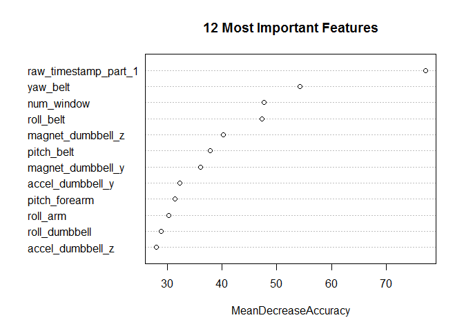

# Activity Recognition of Weight Lifting Exercises
Bas Biezemans  
November 22, 2016  

## Synopsis

This report analyzes the data from accelerometers on the belt, forearm, arm, and dumbbell of 6 participants to predict the manner in which they did the exercise. Participants were asked to perform one set of 10 repetitions of the Unilateral Dumbbell Biceps Curl in five different fashions: exactly according to the specification (Class A), throwing the elbows to the front (Class B), lifting the dumbbell only halfway (Class C), lowering the dumbbell only halfway (Class D) and throwing the hips to the front (Class E). Class A corresponds to the specified execution of the exercise, while the other 4 classes correspond to common mistakes.

#### Background

Using devices such as _Jawbone Up_, _Nike FuelBand_, and _Fitbit_ it is now possible to collect a large amount of data about personal activity relatively inexpensively. These type of devices are part of the quantified self movement - a group of enthusiasts who take measurements about themselves regularly to improve their health, to find patterns in their behavior, or because they are tech geeks. One thing that people regularly do is quantify _how much_ of a particular activity they do, but they rarely quantify _how well they do it_. They were asked to perform barbell lifts correctly and incorrectly in 5 different ways. More information is available from the website here: <http://groupware.les.inf.puc-rio.br/har> (see the section on the Weight Lifting Exercise Dataset).


```r
library(data.table)
library(dplyr)
library(randomForest)
```


```r
pml.data <- fread("https://d396qusza40orc.cloudfront.net/predmachlearn/pml-training.csv")
```

The dataset has the following dimensions:


```r
dim(pml.data)
```

```
## [1] 19622   160
```

## Data Processing

While exploring the data set we can see that there are several non-numerical variables. We will remove all of them, except the _classe_ variable (the outcome), as we need quantitative data. There are also several variables with mostly NA values. We will remove these as well because it only adds noise to the data. The result is a tidy subset that we can use for classification.


```r
set.seed(12345) # ensures reproducible results

pml.data <- as.data.frame(pml.data)

# Subset selection: filters non-numeric columns
# and columns with NA values
selectSubset <- function(df) {
    labels <- df$classe
    num <- sapply(df, is.numeric)
    df <- df[, num]
    na <- sapply(df, anyNA)
    df <- df[, !na]
    cbind(df, classe = labels)
}

pml.subset <- selectSubset(pml.data)

subset.dim <- dim(pml.subset)
subset.dim
```

```
## [1] 19622    56
```

## Model Building

In their [research paper](http://groupware.les.inf.puc-rio.br/public/papers/2013.Velloso.QAR-WLE.pdf), Eduardo Velloso et al. used a Random Forest approach because of the characteristic noise in sensor data. They used an ensemble of random forests with a smaller number of trees. I decided to find out what the result would be of a single random forest classifier with the default number of trees (500), because Random Forest is itself an ensemble learning method for classification.

Creating a random forest model with 56 features can be computationally intensive, depending on your computing hardware. Reducing the number of features in a dataset will speed up the modeling process. In order to reduce the number of features we need to find out which ones are important. Eduardo Velloso et al. used a feature selection algorithm based on correlation. I decided to select the features based on the mean decrease in accuracy when a feature is not used in building a tree. To reduce the runtime I selected a sample of 2000 rows.


```r
sample <- slice(group_by(pml.subset, classe), 1:400) # five classes, 400 rows per class
sample <- as.data.frame(pml.subset)                  # grouped_df to data.frame

predictors <- select(sample, -classe)
outcome <- factor(sample$classe)

mdl.fit <- randomForest(predictors, outcome,
                        # Minimum size of terminal nodes (larger n takes less time)
                        nodesize = 10,
                        # Assess the importance of predictors
                        importance = TRUE,
                        # Number of variables randomly sampled at each split
                        tuneGrid = expand.grid(mtry = c(2)))
```


```r
varImpPlot(mdl.fit, type = 1, n.var = 12, main = "12 Most Important Features")
```

<!-- -->

The next step is to take the subset with most important features and split it into a training and test set.


```r
# Select the 12 most important features
imp.feat <- as.data.frame(importance(mdl.fit, type = 1))
imp.feat <- head(imp.feat[order(-imp.feat),, drop = FALSE], 12)

features <- rownames(imp.feat)
pml.subset <- subset(pml.data, select = c("classe", features))

# Simple partition function
createDataPartition <- function(v, p) {
    data.len <- length(v)
    smp.size <- floor(p * data.len)
    set.seed(123) # reproducible sample
    sample(seq_len(data.len), size = smp.size)
}

in.train <- createDataPartition(pml.subset$classe, p = .7)
training <- pml.subset[in.train,]
testing <- pml.subset[-in.train,]

training$classe <- factor(training$classe)
testing$classe <- factor(testing$classe)
```

#### Training the Model

Now we can train a model with the training set. Afterwards we will make a prediction with the model on the test set and compare the accuracy. We won't use cross-validation because there are enough trees (500) in the forest to prevent overfitting the model. The optimal _mtry_ value is in this case 3. The _mtry_ argument is the number of variables (features) randomly sampled as candidates at each split in the tree.


```r
predictors <- select(training, -classe)
outcome <- training$classe

mdl.fit <- randomForest(predictors, outcome, tuneGrid = expand.grid(mtry = c(3)))
mdl.fit
```

```
## 
## Call:
##  randomForest(x = predictors, y = outcome, tuneGrid = expand.grid(mtry = c(3))) 
##                Type of random forest: classification
##                      Number of trees: 500
## No. of variables tried at each split: 3
## 
##         OOB estimate of  error rate: 0.07%
## Confusion matrix:
##      A    B    C    D    E  class.error
## A 3923    0    0    0    0 0.0000000000
## B    1 2685    0    0    0 0.0003723008
## C    0    3 2362    1    0 0.0016906171
## D    0    0    2 2251    1 0.0013309672
## E    0    0    0    2 2504 0.0007980846
```


```r
cat("Accuracy =", (sum(diag(mdl.fit$confusion)) / nrow(training)))
```

```
## Accuracy = 0.9992719
```

#### Accuracy on the Test Set


```r
prediction <- predict(mdl.fit, testing)
correct <- prediction == testing$classe

table(prediction, testing$classe)
```

```
##           
## prediction    A    B    C    D    E
##          A 1657    0    0    0    0
##          B    0 1109    3    0    0
##          C    0    2 1053    1    0
##          D    0    0    0  961    0
##          E    0    0    0    0 1101
```

```r
cat("Accuracy =", (sum(correct) / nrow(testing)))
```

```
## Accuracy = 0.9989808
```

#### Expected Out-of-Sample Error

Based on our model, the expected out-of-sample error rate is 0.1% (1 - accuracy). This is only slightly higher than the estimated in-sample error rate of 0.07%.

## Prediction of 20 Test Cases

Finally, we can use the model to predict classes of the PML-testing data set. The same features are selected as before.


```r
test.data <- fread("https://d396qusza40orc.cloudfront.net/predmachlearn/pml-testing.csv")
```


```r
test.data <- subset(test.data, select = features)

predict(mdl.fit, test.data)
```

```
##  1  2  3  4  5  6  7  8  9 10 11 12 13 14 15 16 17 18 19 20 
##  B  A  B  A  A  E  D  B  A  A  B  C  B  A  E  E  A  B  B  B 
## Levels: A B C D E
```

## Conclusion

Our model achieved 99% accuracy, which is extraordinary. It shows how powerfull the Random Forest algorithm is as a classifier, given a large enough training set. A disadvantage of Random Forest is that it can be very slow. We noticed this while training our model with 500 trees. I can imagine that is why Eduardo Velloso et al. chose to use an ensemble of random forests with a small number of trees per model.

#### Precision and Recall

Accuracy can be a misleading measure of model performance but in this case both precision and recall are also very high:


Precision: 0.9988639

Recall: 0.9988922

---

